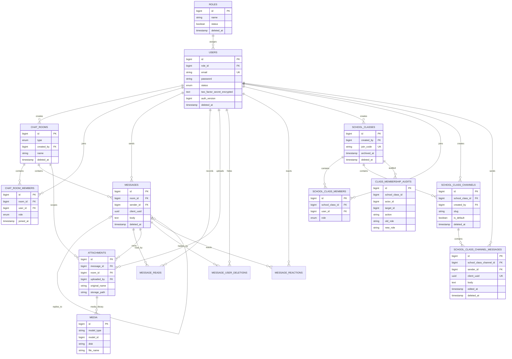

# ER Diagram

The diagram reflects the persisted collaboration core. Framework cache, job, session and password-reset tables are omitted. Call tables remain in the schema as legacy data but are outside the release MVP.

`class_membership_audits` intentionally keeps historical numeric identities without cascading foreign keys. Media Library uses a polymorphic `model_type` and `model_id`, so its attachment relation is enforced by application logic rather than a database foreign key.

